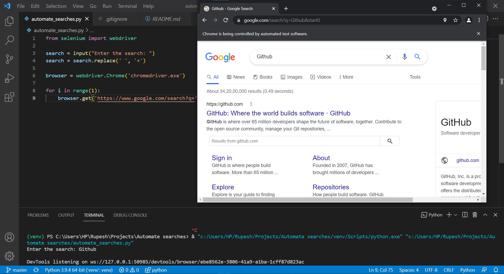

# Google search automation
This program allows us to use seleniums webdriver module to 
make web requests to browsers. 

To run the program on your computer you need to have [chromedriver.exe](https://chromedriver.chromium.org/)
in the same directory as this .py file.
You should also have selenium package installed 
Command:
pip install selenium
(Better if you create a virtual environment if you don't need it globally)

here is the output:
(A chrome window pop up when you type the search in prompted space.)
